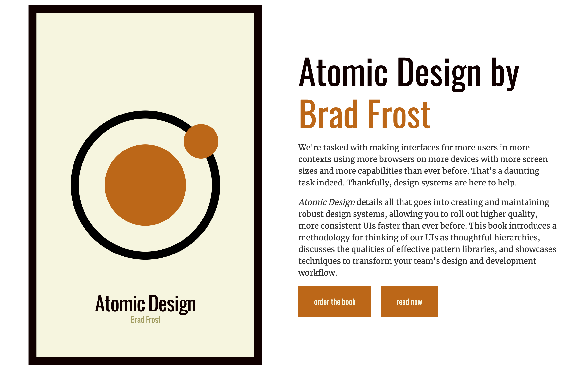

前端工程师 Brad Forst 将化学中的原子概念运用到界面设计中，他讲界面解构为 5 个层面：原子、分子、组织、模板、页面。在设计迭代节奏越来越快的今天，运用这套原子设计理论可以大大提高设计元素的复用性，让设计效率翻倍。

如果你要构建设计系统，一定要读这本书，了解原子设计的基本原则和方法。

### 参考
- [Atomic Design 原子设计](https://zhuanlan.zhihu.com/p/26130595)
- [原子设计知乎专栏](https://zhuanlan.zhihu.com/atomicdesign)
- [網頁設計 : Atomic Design簡介及工作實例](https://medium.com/uxeastmeetswest/%E7%B6%B2%E9%A0%81%E8%A8%AD%E8%A8%88-atomic-design%E7%B0%A1%E4%BB%8B%E5%8F%8A%E5%B7%A5%E4%BD%9C%E5%AF%A6%E4%BE%8B-42e666358d52)
- [[译] 原子设计：如何设计组件系统](https://juejin.im/post/59780066f265da6c3433872f)
