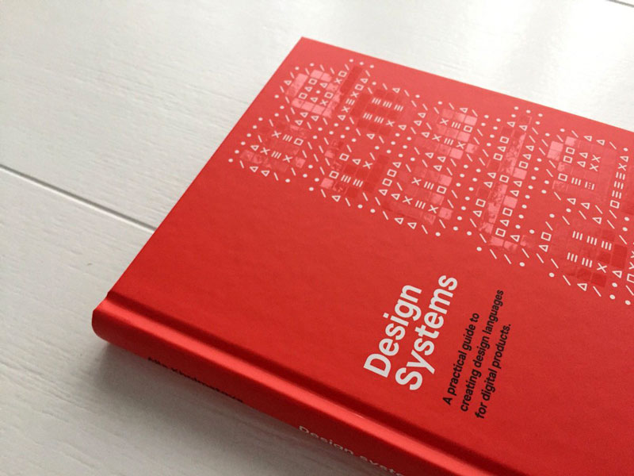

这是一本特别全面的关于设计系统的书，作者讲述了设计系统是什么，设计模式和设计原则，如何组建团队，如何构建设计系统等等。这本书只有英文版，但国内有一些设计师写过相关的文章，可以阅读了解一下。

### 参考
- [什么是 Design System](https://mp.weixin.qq.com/s/wFVCQO5ww07HgNjHsdNXkg)
- [《Design systems》设计系统该如何建立](https://zhuanlan.zhihu.com/p/33345487)
- [设计系统——Beforweb 译文](https://mp.weixin.qq.com/mp/homepage?__biz=MjM5MDc0MDIyMA==&hid=7&sn=44891e3f30ea33a58e75777469df3713&scene=1&devicetype=android-28&version=27000435&lang=zh_CN&nettype=3gnet&ascene=7&session_us=gh_d257e9024f84&wx_header=1)
- [Beforweb 设计系统相关文章](http://mp.weixin.qq.com/mp/homepage?__biz=MjM5MDc0MDIyMA==&hid=5&sn=1dcb31e7c2343e1eb21f4b88a5fd66a5&scene=1&devicetype=android-28&version=27000435&lang=zh_CN&nettype=3gnet&ascene=7&session_us=gh_d257e9024f84&wx_header=1)
