原文首发于公众号 Codesigner：https://mp.weixin.qq.com/s/URQhyhvqZ3MEdv3A-osCTw

开始构建设计系统总是令人望而却步的，因为要考虑的事情太多了，比如设计的样式，设计系统的规模化和可扩展性，其他团队的使用方式，如何在公司内顺利推广，如此种种。那么，设计师到底该从哪里开始呢？

我们不妨将这个大问题剖析成一个个小问题，一个个去解决。在开始之前，让我们先想一想哪些人会参与进来，这些人或团队又是如何协作的？当你搞清楚了这个问题，就可以开始思考这个系统的设计语言，包括颜色、排版、间距等等。你的视觉设计语言将会是整个可以快速构建界面的组件式 UI 库的基础。

接下来，让我们一步步地看一下该如何设计你的设计系统。

## 哪些人会参与其中？
在开始构建设计系统之前，先想一想你需要一个什么样的团队，需要哪些人参与其中。先剧透一下，构建设计系统所需要的不仅仅是设计师哦。

下面有一个简单的列表，列出了构建一个高效的设计系统可能需要的成员角色：
* **设计师**：定义整个系统的视觉元素
* **前端开发**：编写模块化的高效的代码
* **无障碍专家**：保证你的设计系统符合无障碍标准，如 [WCAG](https://www.w3.org/Translations/WCAG21-zh/)（译者注：国外的无障碍普遍做得比我们好，希望我们能够提升自己的无障碍意识，帮助更多人使用互联网产品）
* **内容策略专家**：他们可以帮助团队确定整个系统的声音和语调
* **用户研究员**：他们帮助你更好地理解用户的需求
* **产品性能专家**：他们确保你的系统能够在各种设备上良好运行
* **产品经理**：确保系统符合用户需求
* **领导者**：（总监或主管）负责传达和同步公司或公司高层的愿景

一旦找到了在以上各个部分有经验的人，接下来就要找到设计系统团队中每个部分的带头人，这些人应该是能够在关键时刻推动决策向前的，他们了解团队中哪部分人是支持设计系统的。

当我们拥有了一个强大的领导团队，下一步就是根据实际情况来确定团队模型。

## 选择正确的团队模型
选择一个正确的团队模型对于构建一个设计系统同样至关重要。在《[规模化设计系统所需的团队模型](https://medium.com/eightshapes-llc/team-models-for-scaling-a-design-system-2cf9d03be6a0)》一文中，有经验的设计系统构建者 [Nathan Curtis](https://twitter.com/nathanacurtis) 给我们描绘了三种比较流行的团队模型。

**单人负责模式**：由某一个人负责整个设计系统。

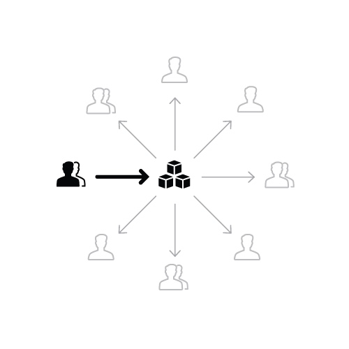
>单人负责模式，图来自 Nathan Curtis

**独立团队模式**：由一个独立的团队专门负责设计系统。
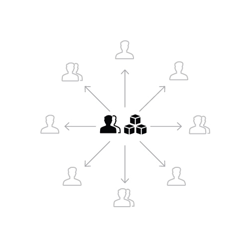
>独立团队模式，图来自 Nathan Curtis

**联合维护模式**：从不同团队抽调一些人来共同构建维护设计系统。
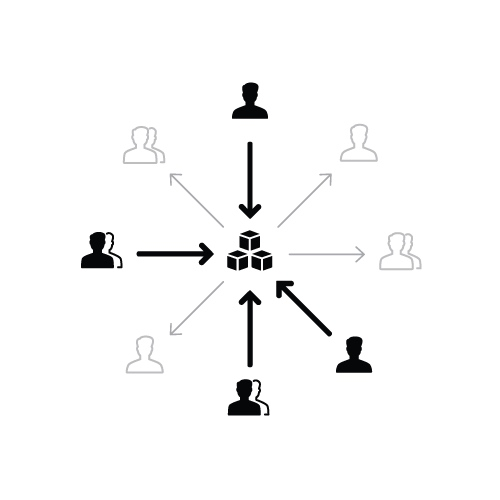
>联合维护模式，图来自 Nathan Curtis

上述三种团队模型各有优劣。单人负责模式响应迅速，且敢于突破，但其上限受制于这个人的水平；独立团队模式可以保障设计系统正常迭代，但这个团队因为离用户较远，可能会导致设计系统不能符合用户需求；最后，联合维护模式虽然可以很好地理解产品或用户需要什么，但也会因为常常忙于此而忽略了系统的正常构建。

许多公司最开始是单人负责模式，最后慢慢演变为后两种模式。正如 Curtis 在他的文章中所说的那样，后两种模式更适合设计系统的扩展和规模化，而单人负责模式则处处受限。

我曾经写过一篇关于 [Salesforce 团队模型](https://medium.com/salesforce-ux/the-salesforce-team-model-for-scaling-a-design-system-d89c2a2d404b)的文章。当我还在 Salesforce 的 [Lightning 设计系统](http://salesforce.com/designsystem)团队时，我们采用的是独立团队和联合维护相结合的团队模式。在一个庞大如 Salesforce 的企业团队，一个独立团队已经不足以支撑设计系统的建设。越来越多的人参与其中，以及我们要覆盖的平台和产品越来越广，我们必须要找到一种更加可持续的方法。

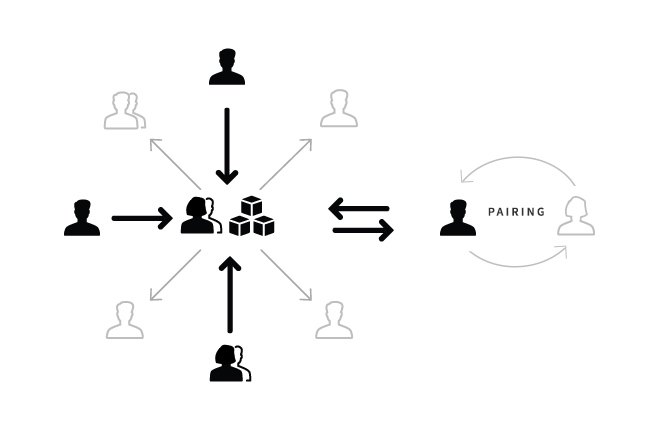
>一种混合的团队模式——由一个独立团队和来自其它团队的人一起维护设计系统

尽管 Lightning 设计系统当时已经有一个核心团队，但仍然有来自于其他产品或业务团队的人参与其中。他们来自 Salesforce 各个不同的部门，作为设计系统的联合参与者，不断贡献新想法，提出新需求，共同推进设计系统不断演进。研究员、无障碍专家、产品设计总监、交互设计师和用户体验工程师一起协助核心设计系统团队，构建设计模式、组件和整个设计系统。工程师不断优化代码以提升性能，保证可以用于真实产品中。

尽管单人负责模式因为很容易受到个人能力限制而很少被采用，但这种模式对于有些情形还是挺适用的。[Mina Markham](http://mina.codes/#%F0%9F%92%8B) 曾经为 Hillary Clinton 的政治竞选活动做网站等线上产品，但变化巨快的节奏让她疲于应付。后来，她自己做了一个叫做 [Pantsuit](https://medium.com/git-out-the-vote/pantsuit-the-hillary-clinton-ui-pattern-library-238e9bf06b54) 的设计系统，来帮助不同地方的设计团队加快进度，并使产出物具有品牌一致性。这种单人负责模式让 Markham 可以专注于设计速度。显然这是另外一种截然不同的模式，虽然这种模式不适用于大多数企业，但对于当时的情形却十分受用。

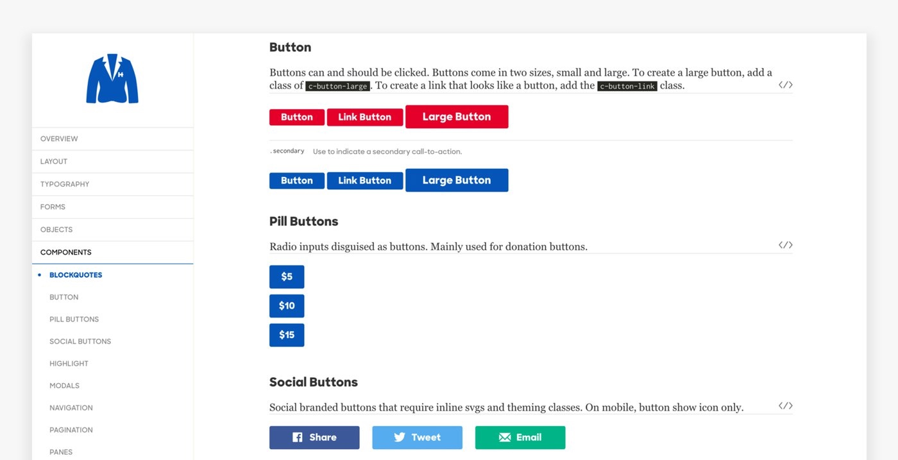
>Pantsuit，Mina Markham 2016 年为 Hillary Clinton 竞选活动创建的一个设计系统。

当你在决定适合你团队的模式时，先考虑你的目标。如果你想要快速推进，单人模式是最合适的，尽管事后需要做一些工作来让其他团队采用它；如果你想要快速推进，同时想在一开始就让团队采用，那么独立团队是最适合的了；如果想让团队尽早采用的同时，还想让更多人参与进来，联合维护模式是最优选项。但无论是何种情况，请记住“[设计系统是一个产品](https://medium.com/eightshapes-llc/a-design-system-isn-t-a-project-it-s-a-product-serving-products-74dcfffef935)”，所以你应该以对待产品的态度去对待它，而不是仅仅把它当做一个项目。也就是说，你应该让大家持续参与进来，不断维护和升级设计系统。

当团队组建完毕，你就可以开始设计你的设计系统了。

## “用户”访谈
和其他产品设计环节一样，用户研究是很重要的一环。谁将会使用你的设计系统？他们又是如何使用的？当你深刻地知道这些问题的答案，你的设计系统就能够更好地适应团队，让团队更高效地使用它。通过对用户的研究，你可以提前定位到问题所在，据此来设置最适合团队的规范，并将大部分精力投入到最重要的问题中。

还有一类不太常见的需要访谈的人是开源社区的用户，这通常是是对外开源了设计系统的团队需要考虑的。开源后，你的设计系统将会有潜力变成一个大型项目，这依赖于其潜在参与者的反馈和贡献，因此你需要寻找一种能够让你的设计系统适应他们的使用方式。

接下来就是管理层的人员，你也需要清楚他们的想法，因为在这个过程中你需要他们的支持。了解一下他们关心什么东西，将这些作为需要达到的可执行目标或指标。通常他们会有这些要求：能够快速迭代新特性，性能要好，UI 设计的质量需要提升，等等。

>**基于实践性研究来创建强大的样式指南**
>Isaak Hayes 和 Donna Chan 曾在 [Clarity 大会](https://www.clarityconf.com/)上有过一次有意思的对谈：[基于实践性研究来创建强大的样式指南](https://www.clarityconf.com/building-empowering-style-guides-with-practical-research/)，他们提出了一系列有用的技巧，来帮助你对设计系统进行有效的研究。研究后所得到的数据，可以用来指导创建设计规范、指标和用户故事。

基于对用户研究的洞察，现在可以开始创建设计资源库了。这个过程分为两步：

- 设定一系列视觉属性，比如间隔大小、颜色、文字排版等等，这可以帮助你将你的设计语言编码化。
- 设定一系列 UI 元素，比如按钮、卡片、模态框等等，这将会帮助我们创建一系列设计组件。

## 提取所有现有设计资源
当然，如果你是给一个还没做出来的产品创建设计系统，可以跳过这一步，直接到创建视觉语言那一章节，本章节的讨论是基于已有产品的。

### 设计走查
在我们创建一个设计资源库之前，先对现有产品进行一次彻底的设计走查，提取出现存的所有设计属性和 UI 组件。使用诸如 [CSS Stats](http://cssstats.com/) 这种工具来检测你的产品使用了多少样式规则、选择器、属性定义。他可以清晰地展示产品中使用的颜色、字号、字体，也能够以条状图的形式显示间隔和元素尺寸信息，这样你就能对哪些样式需要删除哪些样式需要合并一目了然了。

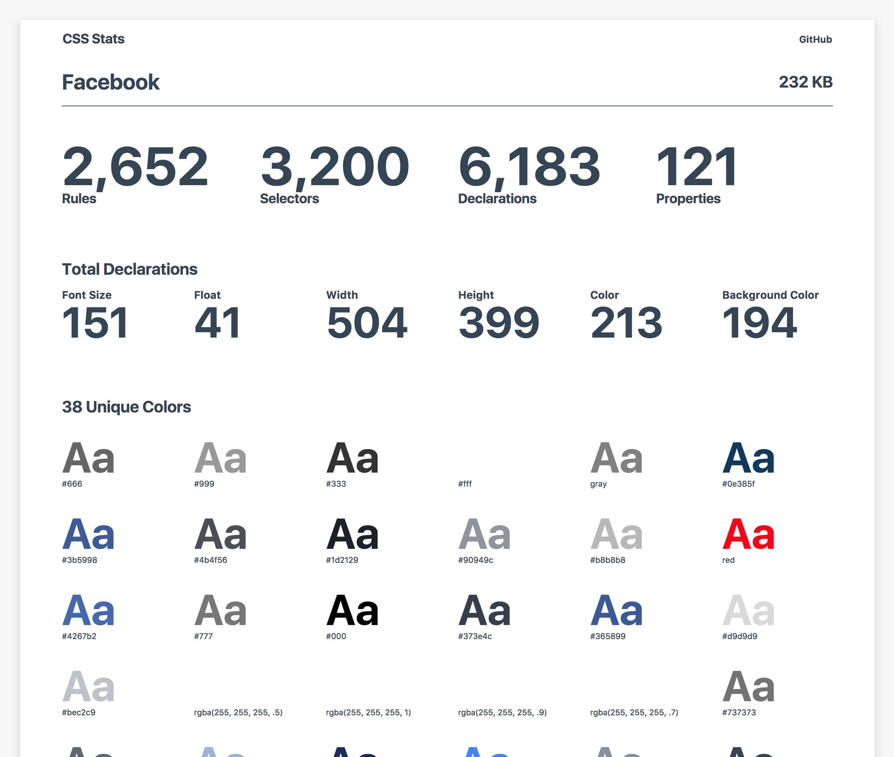
>CSS Stats 检测出 Facebook 使用了 38 种不同颜色

如果你是在 Sketch 中做这件事，可以使用 [Sketch-Style-Inventory](https://github.com/getflourish/Sketch-Style-Inventory) 来提取所有的颜色、字号和 Symbol，它同样也可以帮助你合并相似的样式。

## 创建一个视觉设计语言
必须承认，作为艺术学院毕业生创建设计语言是我最喜欢的工作部分。我喜欢思考颜色理论、排版、布局，它们是一个设计系统的核心部分。

如果我们将设计系统中的每一个组件进行解构，就会发现是下面这些基本元素或形式组成了这一整个设计语言：

- 颜色
- 排版（尺寸、行距、字体等）
- 空间距离（外边距、内边距、位置、描边大小）
- 图片（图标、插画）
你也许还会用以下内容来标准化产品的用户体验，这取决于你们团队或产品的需求：
- 视觉形式（层级、立面、阴影、圆角、纹理）
- 动效
- 声音

考虑它们在一个简单的组件中会扮演一个什么样的角色，起什么作用。就拿按钮来说，一个按钮一般会有一个背景色、文字样式、以及内部间距，有时候可能里面还会有一个图标作为视觉线索。有些时候我们会使用边框或圆角给按钮增加一些装饰。最后，考虑一下在用户鼠标移进或者按下时我们要显示一个动画或者播放一段声音作为响应反馈。可以看到，即使一个简单的按钮里面就有很多需要进行设计决策的地方，只有这样我们才可以给组件赋予生命。

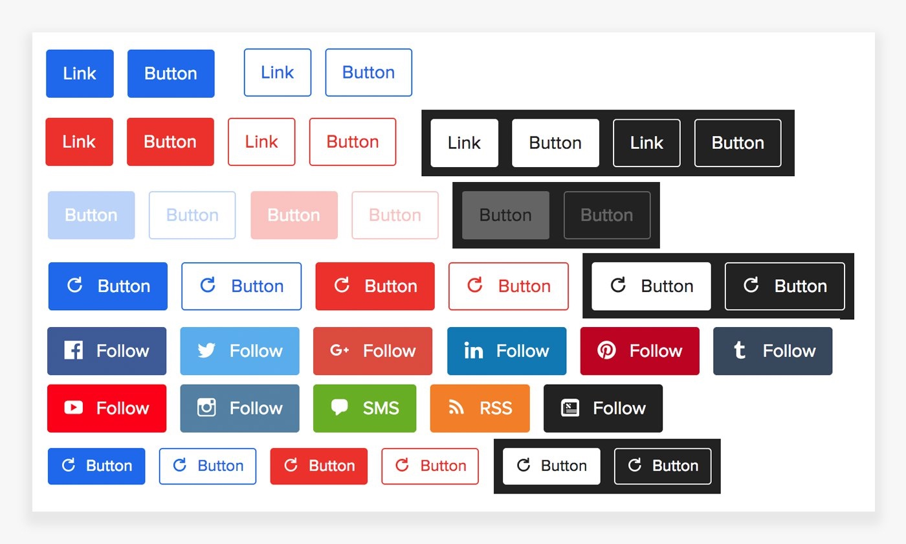
>Buzzfeed Solid 设计系统中的按钮的诸多变体。按钮一般以下面这些形式用于不同位置的按钮元素或链接：primary、secondary、transparent、negative、white、disabled、with icons、social、small、small with icons、small social 当然你还可以根据需要自定义颜色。

### Design tokens
在我们深入视觉规范之前，我想先讨论一下 design tokens（译者注：没想到比较好的翻译，可以理解为一系列决定产品的设计风格的属性和值）。design tokens 是设计系统亚原子层级的基础，最简单的情况下它们就是一些抽象出来的成对的属性和值（后文称属性值对），存储于某处用于统一管理。当所有的设计属性值对集中于某一处统一管理时，你的产品就更容易达到设计统一，并且也能减轻设计系统维护负担。

举个栗子，`PRIMARY_COLOR: #09C` 就是一个 design token，它表示的是产品的主色。其它诸如空间距离、尺寸、动画时间等，都可以作为 design tokens，最后再将它们应用于不同平台的产品。

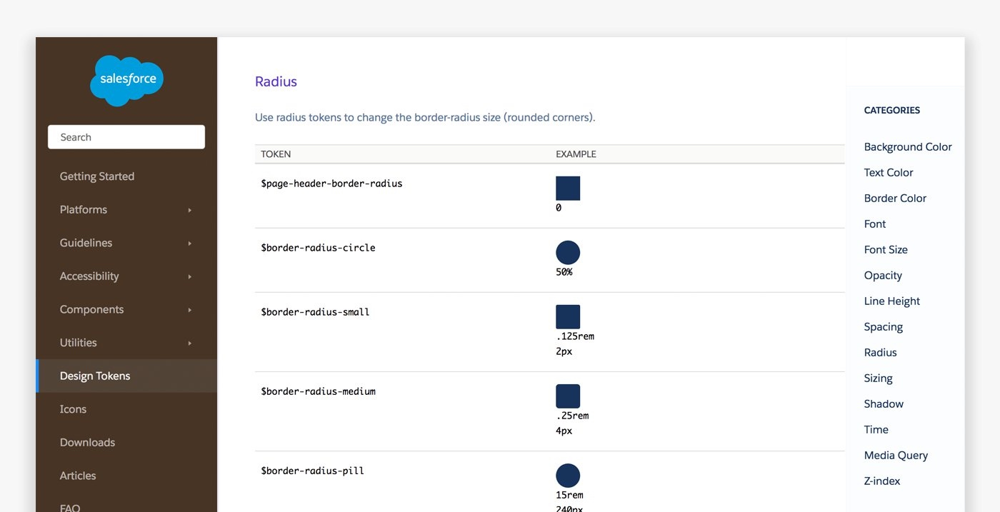
>Lightning 设计系统中不同圆角大小就是 design tokens

### 颜色
颜色，在设计系统中不仅仅是品牌的拓展，它还可以在用户界面中传达：

- 反馈：错误或成功状态。
- 信息：图标、图形和向导元素。
- 层级：通过颜色和排版来表现元素层级。

通常一个设计系统中需要会包含一到三种能传达品牌的主色，但如果它们不适合按钮或链接的话，你可能还需要额外增加一个颜色来用于按钮或链接。一般来说，按钮背景和链接保持一致的话，用户会更容易识别可交互的操作。

当然，你还需要一些辅助色，比如一些背景、描边（一般是灰色的）。最后，你还需要一些代表状态的颜色，比如错误、警告和成功。将这些颜色放在一起，不断地微调，直到它们可以和谐地显示于你的产品之中。

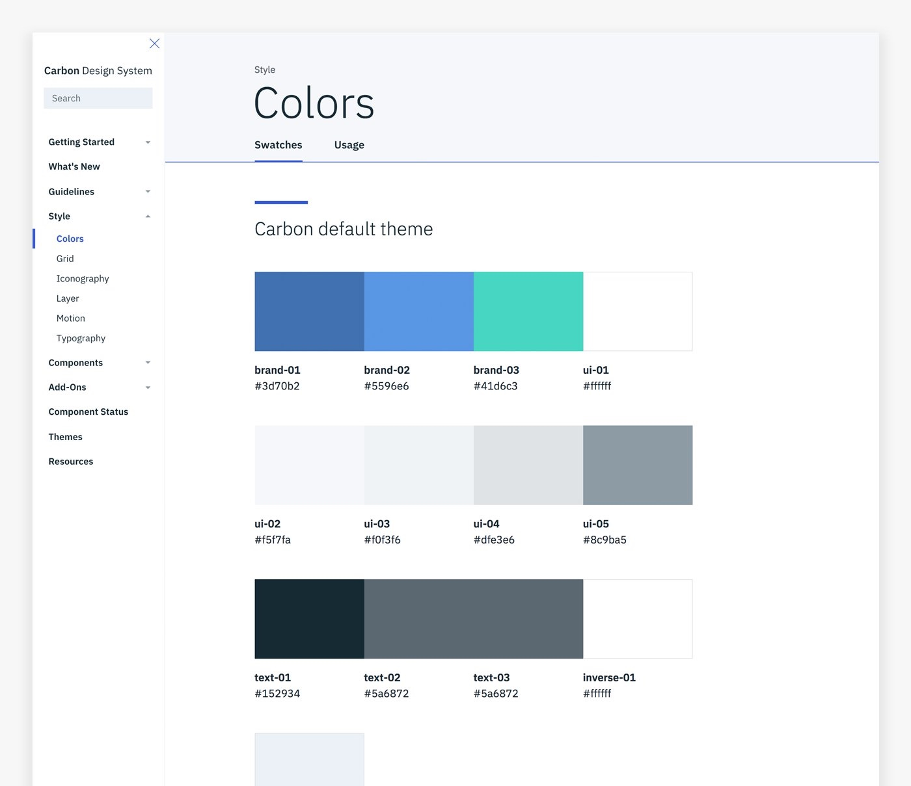
>Carbon 设计系统的颜色 design tokens

>**小贴士**
>Rune Madsen 正在写的一本书《[Programming Design Systems](https://programmingdesignsystems.com/)》中，有一些章节是关于颜色的，包括“[色彩理论简史](https://programmingdesignsystems.com/color/a-short-history-of-color-theory/index.html#a-short-history-of-color-theory-xZzRFOZ)”，可以读读。

在大一些的设计系统中，颜色会被用来代表某一个对象或者产品。例如，在 Salesforce 中，我们会用不同颜色区分联系人、交易、小组等，也会用颜色区分不同产品，比如销售云、市场云、统计云等等。在产品中颜色对于用户向导可以有非常好的效果。

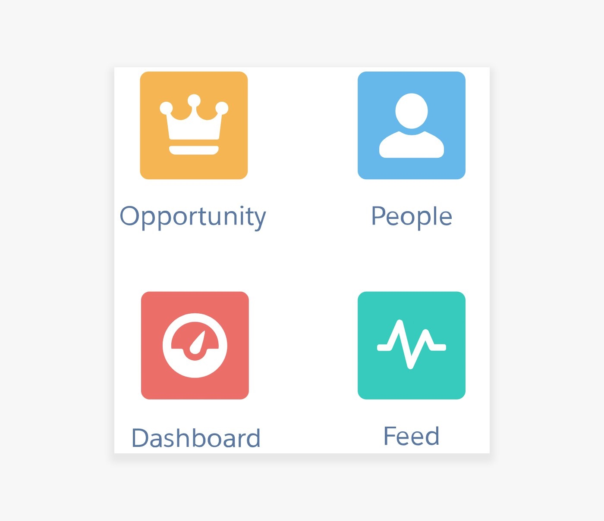
>Salesforce 中不同对象的颜色。

尽管使用颜色可以给用户一些引导，但对于无障碍可访问性会有些问题，因为色盲用户会难以分辨其中的区别。

>**检查颜色对比**
>有很多[颜色检查的工具](http://www.webaxe.org/color-contrast-tools/)，可以帮助我们确保我们的产品颜色对用户是友好的。我们需要确保文字颜色和背景色之间的对比度足够大，方便用户阅读。

根据你对颜色的严瑾程度，你可能会需要一些变浅或变暗的色值，一般是通过混合白色或黑色来实现。但有时候你也可以会通过混合其他颜色来实现，比如给黄色添加黑色来变暗会有点脏，用橘色就好一些。

这些颜色变体会让设计师有更多选择，但是一定要注意过多的颜色会导致设计不统一。因此，请保持你的色值库在精简的同时，还能够有更多的灵活性。你可以在使用时根据需要不断添加调整它们。

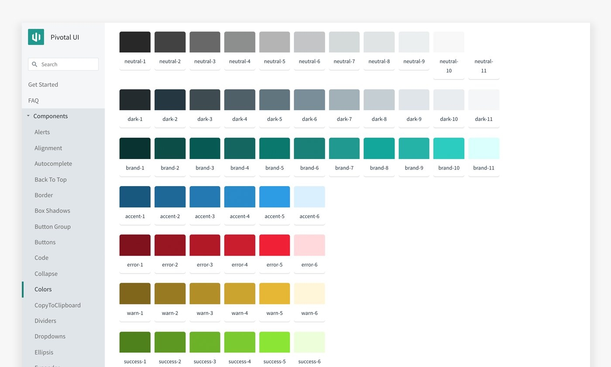
>Pivotal 的一系列颜色及其深浅变化。我一般倾向于只给出一系列线性变化的色彩选项，但是有些设计系统会给出更多选择，这个就需要你自己根据产品特性在创意自由度和严格统一性之间进行权衡了。

### 文字排版
#### 字体和字重
你所使用的字体会同时影响产品的品牌感和用户体验，所以要时刻谨记选择合适的字体。你可以直接使用系统字体，比如 Helvetica、Times New Roman 或 Verdana，因为用户已经很熟悉它们了。也有些公司会使用更符合品牌感的字体，如果要这样做的话最好关注一下这种字体的实际表现，因为它可能会对产品的性能有所影响。

我参与过的大多数设计系统一般都会有两种字体：一种用于标题和正文，还有一种是用于代码的等宽字体。有些时候我们也会给标题设置为另外一种字体，和正文稍微区分开来。一般一个设计系统不需要多种字体，除非说你的设计系统需要支持不同的品牌。使用尽量少的字体不仅是排版设计中的一个重要原则，也可以避免因为字体文件过多给产品带来的性能问题。

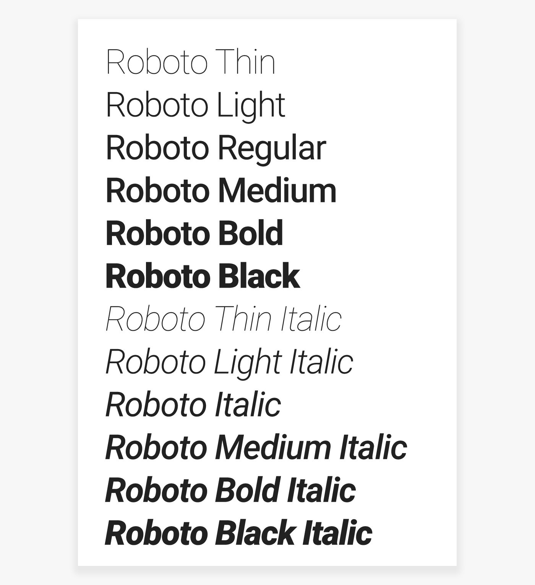
>Google Roboto 字体的不同字重。

最近很流行使用非常细的文字，如果你也要用的话一定要注意可读性问题。我建议还是将这种比较细的字重用在一些大标题上面，而不要用在正文部分。

#### 字号
当你设定字号梯度时，一定要考虑文字可读性。一个通用的字号是 16px，因为这是大多数浏览器的默认字号，对大部分人来说都是容易辨认的。我喜欢用 16px 的字号是因为它符合 Apple 和 Google 以 4px 为基准的度量标准，而且也越来越受到关注。我推荐你将 16px 作为一个基准字号，尽管有时候我会使用一些相对单位，比如 1rem 作为字号单位。

我们可以使用模块化度量（modular scale）的方式来生成更大或者更小的字号，用于其他元素，比如标题。所谓模块化度量，就是使用一个基准字号，通过一个比例来生成下一个字号，以此类推，最终生成一系列的字号。

>**理解模块化度量**
>你可以从[《用模块化度量方法来使排版更有意义》](https://alistapart.com/article/more-meaningful-typography)中了解更多。

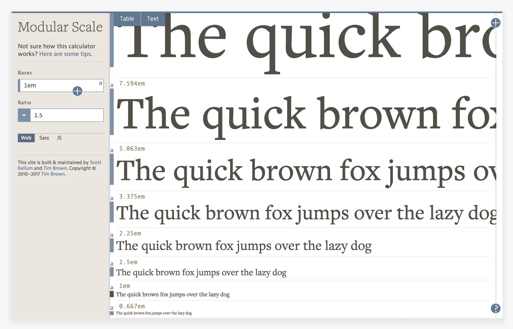
>这个[模块化度量工具](https://www.modularscale.com)可以帮你生成一系列字号，它还可以生成 Sass 代码。

在设置字号梯度时，还有一个需要考虑的事情，那就是让你的文字在任何屏幕上都具有很高的可读性。你肯定不想你的产品在移动设备上显示得很大，也不想它在大屏电脑上变得很小。

有一个常用的方法是不将字号设置为像素单位，而是设置为一个相对于屏幕宽度的比例，比如使用 `rem`和 `em` 单位。

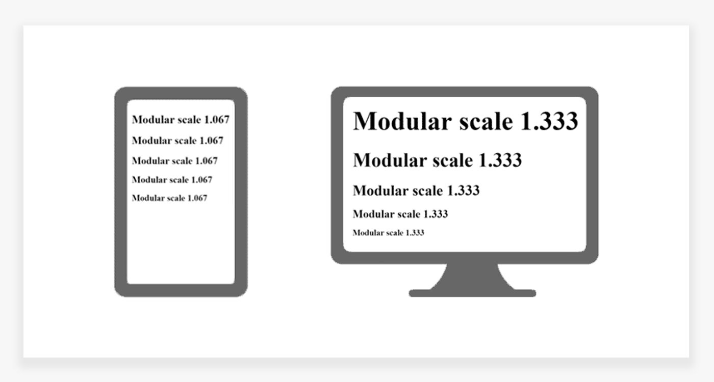

>**响应式排版**
>有很多种方式创建响应式排版，具体可以参考 Zell Liew 的[《响应式排版方法》](https://www.creativebloq.com/how-to/the-rules-of-responsive-web-typography)，它涵盖了大部分用例。

#### 行高
行距，或者是 CSS 中的行高，可以提升文字排版的可读性和美感。合适的行高取决于字体和字号，一般来说设置为字号的 1.4-1.5 倍是比较合适的。[W3C Web Accessibility Initiative](https://www.w3.org/TR/WCAG20) 推荐使用 1.5 倍的行高。

>**段落内行高最好是字号的 1.5 倍，段落间距至少是行高的 1.5 倍**
——WEB CONTENT ACCESSIBILITY GUIDELINES (WCAG) 2.0

它可以帮助你更好地计算行高，但有时候你并不一定需要自己去计算它，你可以直接设置行高为一个数字，浏览器会自动根据字号计算它。

对于标题来说，你可以让它的行高更加紧凑一点。大部分情况下我会将它们的行高设置为 1.25 或者 1.125 倍。

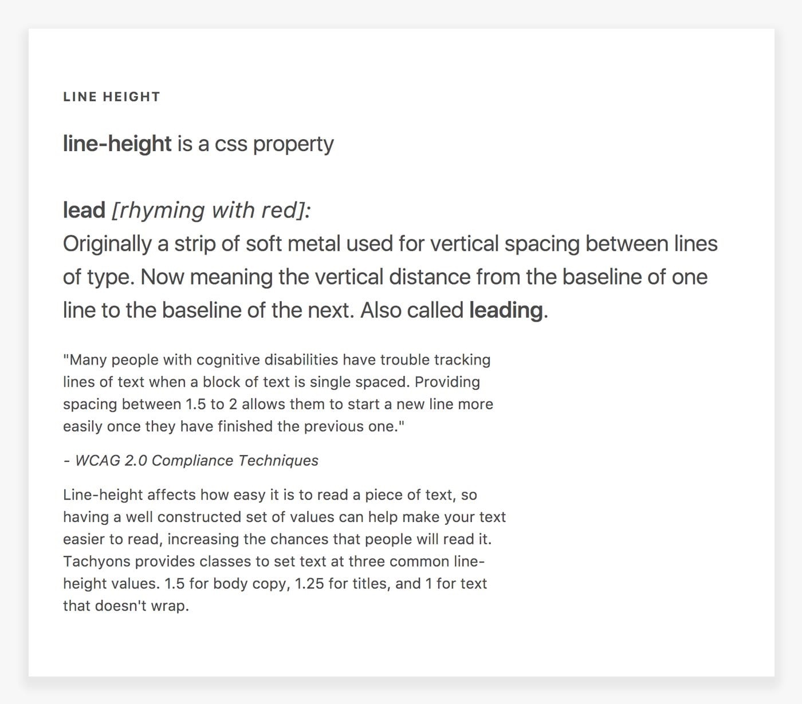
>Tachyons 在正文中使用 1.5 倍，标题使用 1.25 倍行高

### 间隔和尺寸
使用兼具节奏感和平衡感的尺寸间隔，可以让你的排版看起来更加更加舒服。你可以以一个数字为基准，通过一个比例值来衍生出不同的尺寸间隔，这样整个布局会更加整齐有规律，也易于维护。

当我在设计 Android 产品界面时，我注意到 Google 的设计规范中是以 8dp 作为元素间隔值，以 16dp 作为外边距的。我发现相比于我之前使用 10 的倍数作为基准值的习惯，这种以 4 的倍数作为间隔值的方式更好。

以 4 为基准的方式越来越流行，这其中的原因有很多。首先 iOS 和 Android 都推荐以 4 为基准值的方式来定义一些数值。其次，[标准 ICO 尺寸](https://en.wikipedia.org/wiki/ICO_(file_format))也倾向于使用 4 的倍数作为尺寸（16、24、32 等）。再次，浏览器的默认字号是 16px。当所有系统或标准都以 4 为基准时，我们的设计更易于扩展，用于多个地方。

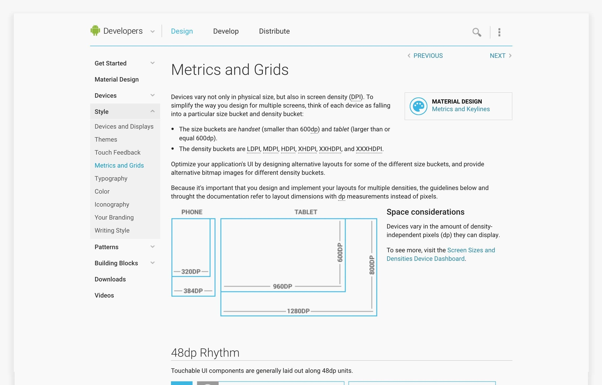
>Google 的 Android 设计规范（现在变成了 Material Design），如果你要设计 Android 界面推荐阅读。

对于横向空间，8 的倍数比较适合作为间距或尺寸。你可以设置它们等于字号或者是字号乘以一个比例，比如 16px、32px。在垂直空间上，我倾向于使用 12 的倍数作为间距或尺寸。这是因为正文的行高一般是 24px（默认字号的 1.5 倍，即 16px*1.5=24px）,12px 正好是它的一半。

但有时候你可能需要打破这个规则，比如说在你给某个元素设置 1px 的描边时。此时你需要设置一个特别的外边距或内边距来抹平这个微小的间隙，所以说还是要根据实际情况来。

有时候你想要让元素根据内容来扩大或收缩，所以如无必要就不要给元素设置一个固定尺寸。这样你的设计就是一个响应式的设计了，这些元素可以自己根据内容去动态地填充布局。

### 图片

#### 文件格式
对于图表或插画，我发现使用矢量格式（SVG）对于稳定性和自适应会更好一些。对于一些需要照片的地方，最好使用栅格化的格式，比如 JPG 和 PNG。

一般来说，不管是照片、插画还是图表，最好都设置宽度为容器或者视窗的 100%，高度为自动适应，这对于响应式设计很有帮助。有些地方如果你想限定它们的宽度，比如说设置为容器的一半或者三分之一，我建议最好再给它设置一个最大宽度，这样在小屏幕上它们会有更好的表现。

#### 图标
在绘制图标之前，先想想你要绘制什么样风格的。比如说它们是实体图标还是描边图标？线的粗细是多少？是单色还是多色？尺寸又是多少？是否有一个边框以及内边距是多少？

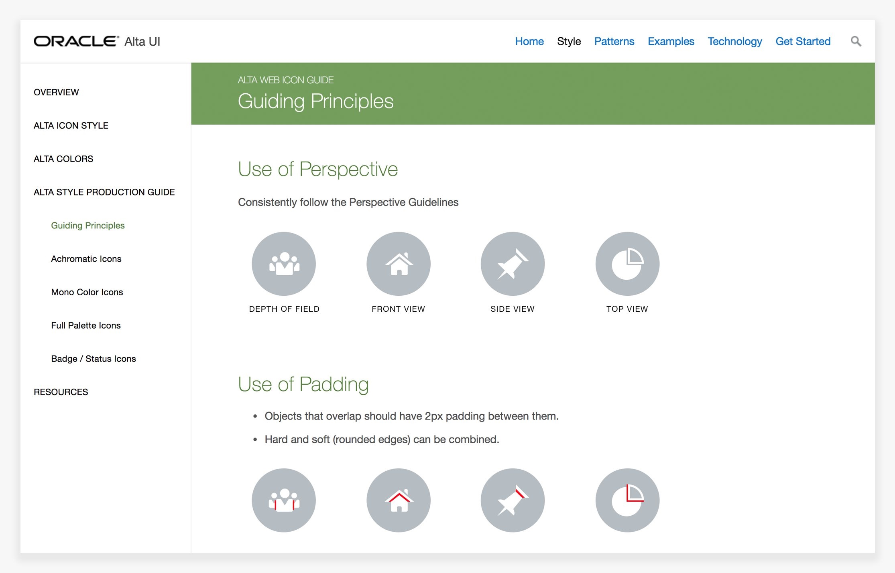
>Oracle Alta 的图标规范注明了其透视、描边和颜色等要求。

也许你的图标系统会包含不同的样式和不同的图标类型。比如说一些辅助或行为图标（比如通知的小铃铛和设置的小齿轮）是单色的实体图标，而一些导航中的图标是多色且更具创意的，就需要你在设计规范中定义好，来保持它们整体的一致性。

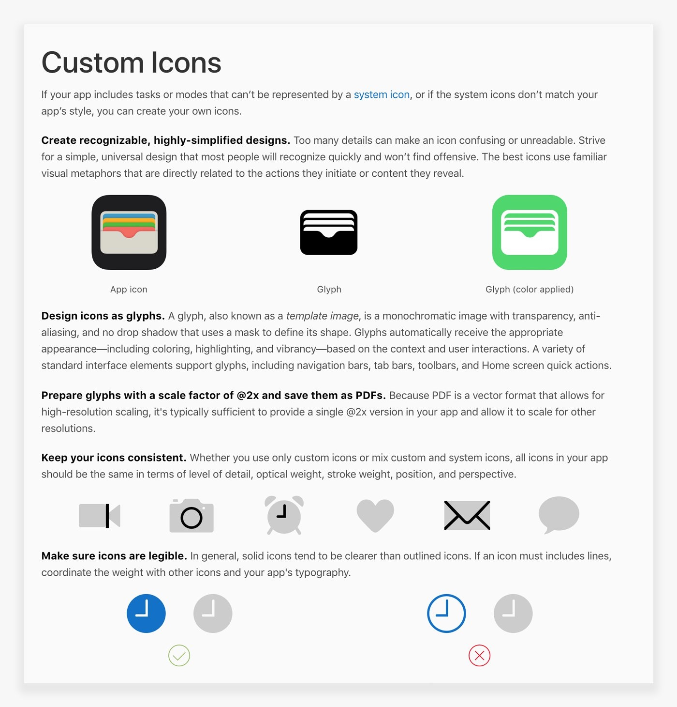
>Apple 的不同类型图标：App 图标，字体图标和带有颜色的字体图标。

#### 插图
插图可以使你的产品更有人格特点。插图一般用于空白页、加载页、模态框和其它需要引起用户注意的地方。[Shopify 会尽量在空白页中使用独一无二的插图](https://ux.shopify.com/empty-states-more-like-you-have-no-idea-how-much-work-goes-into-those-states-amirite-e0102f58b64e)，来传达强烈的品牌感。

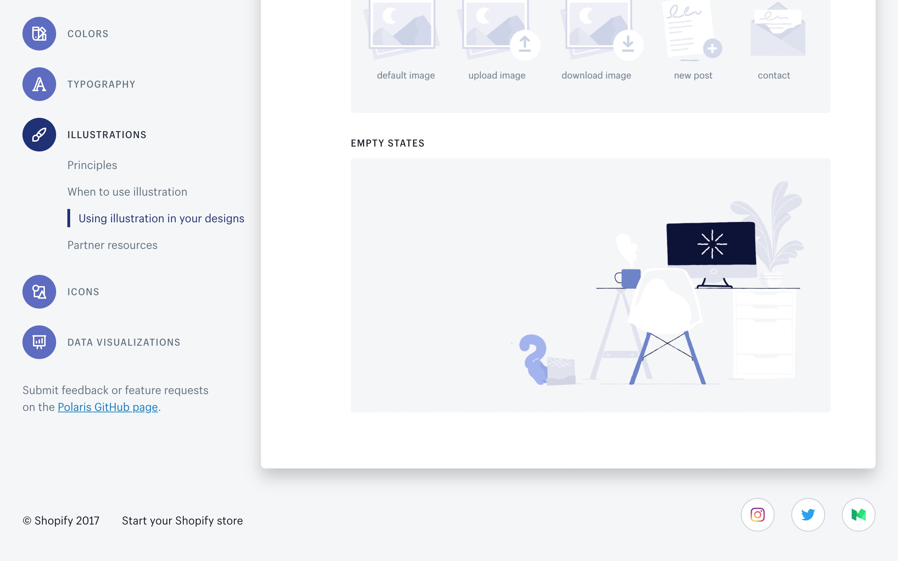
Shopify 的空白页面插图

和图标类似，插图也需要有一个设计规范。

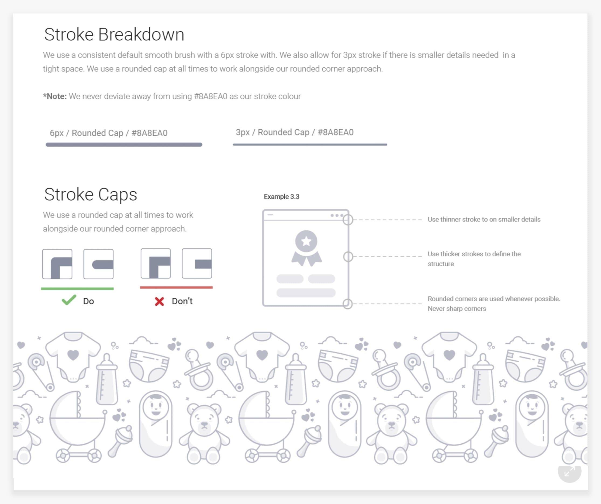
>Al Power 的插图规范。

### 视觉形态
视觉形态，或者说是界面的材质，取决于你的背景图片、渐变、纹理、投影、空间层级、圆角和描边等。这些视觉形式可以帮助你强化元素层级，增添视觉美感，这些也是需要进行标准化的一部分。

Google 关于元素和组件层级的规范是一个很好的例子。

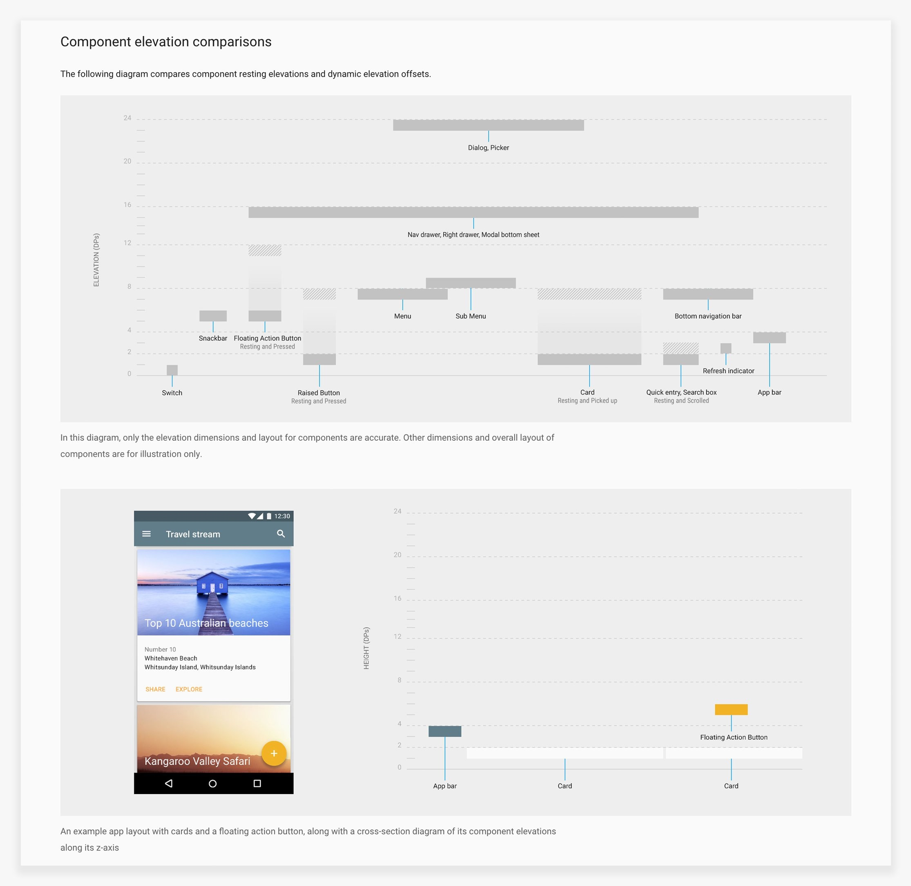
>Google Material Design 中关于元素在空间中的层级和投影设置的例子。

### 动效和声音
当你定义你的设计语言时，动效和声音可能不是一开始就需要被考虑的，但是它们也会对你的产品体验有着很大影响。动效和声音最好也能保持一致，符合你的产品调性。遗憾的是，我个人对这一块的研究还不够多，不过还是有一些可参考的例子。

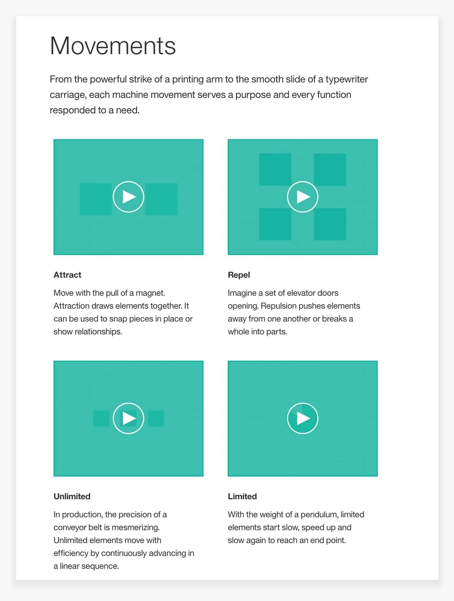
>IBM 基于其产品和技术的动画规范。

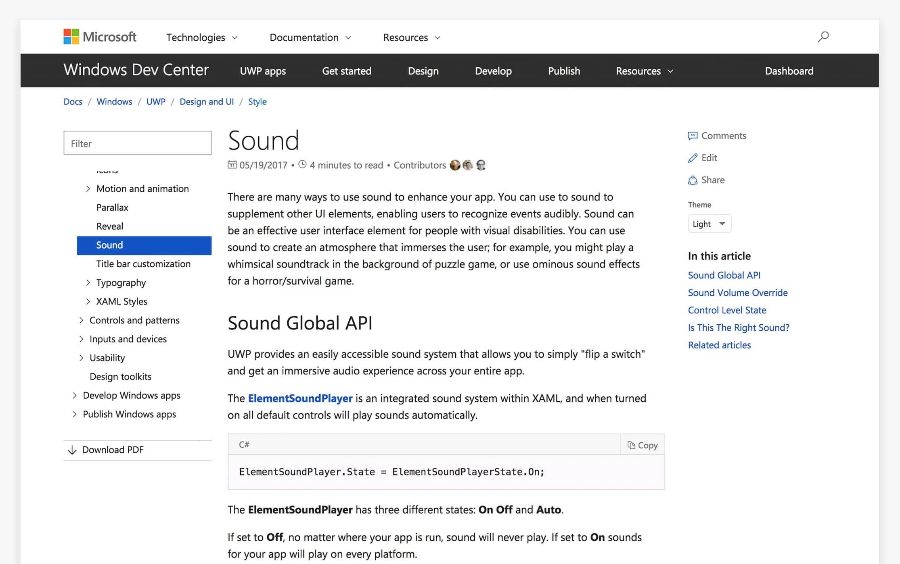
>微软提供给开发者的音效使用指南和 API，虽然有点技术流。

## 创建一个设计共享库
在前面我们罗列了一个完整的视觉语言清单，包含颜色、间隔和排版等等。现在，我们来整理一下界面元素，比如按钮、卡片、列表、表单等。视觉语言更像是一个全局性的东西，而界面元素（或者叫做模式库）则对应着实际的组件和用户界面。

让我们一一来看这些设计元素，并理解它们在设计系统中的角色。你需要盘点所有的界面元素，检查需要处理的“设计负债”，并整理最常使用的设计元素。这个过程可能会有一些令人沮丧，因为很多团队会发现他们公司的产品中有大量不统一的设计形式。

要整理出这个清单，你需要走查产品所有页面并找出所有的按钮、表单、样式、图片等，并将它们置于一处，让所有成员都能看见。

>**视觉化设计负债**
>如果有一些管理人员或者工程师对设计系统持怀疑态度，你可以将这些整理好的的清单展示给他们看，这将有助于让他们更直观地了解“设计负债”。

你可以将这些打印出来，或者投影到显示屏上，和他们一起核对。这样做的主要目的是能够重新整理归类这些元素或组件，并将相似的进行合并。

你们要把它分解为一个个元素、组件、区块等。分解的方式可以参考[原子化设计](https://zhuanlan.zhihu.com/p/26130595)，这是一个很好的概念。通常来说，你会得到下面这些东西：

- **基本元素（原子）**：这是一些很小的，独立的元素，比如按钮和图标。
- **组件（分子）**：由上面的基本元素组成的组件，比如一个搜索表单（有一个输入框、一个按钮和一个搜索图标）。
- **区块（组织）**：这个是更大一些的界面模块，比如左侧导航。
- **布局**：上述元素所构成的整个页面布局（比如一个由顶部导航、侧边栏、页尾和主要内容区域组成的页面）。

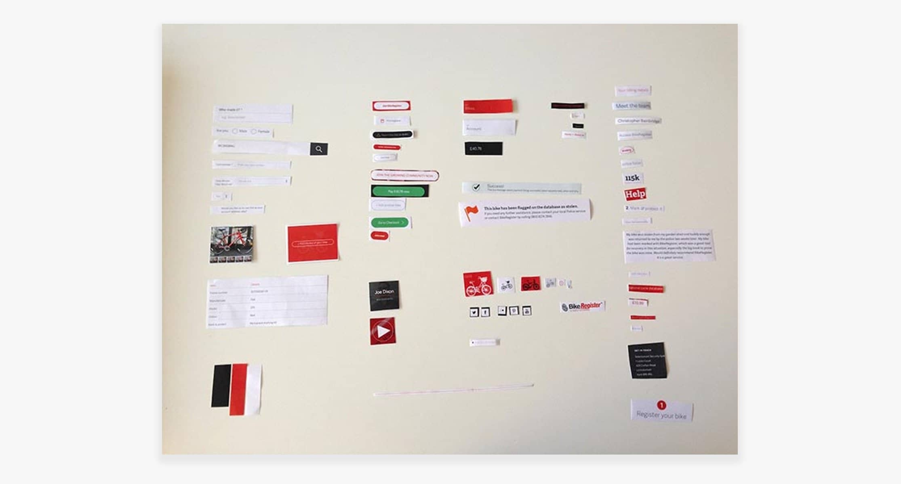
>Charlotte Jackson 在[《从页面到设计模式：每个人都可以尝试的练习》](https://alistapart.com/article/from-pages-to-patterns-an-exercise-for-everyone/)中介绍的一种 UI 元素走查方法。

完成上述的元素走查之后，你可以移除一些无用的模式，合并一些相似的模式（你可以使用一个表格来记录，如果你想马上看到效果也可以直接在代码中重构）。然后，你要把这些整理出来的结果文档化，注明每一个组件或者模式是什么，应该在什么时候使用，这将会形成你们的组件库或者是设计模式库。

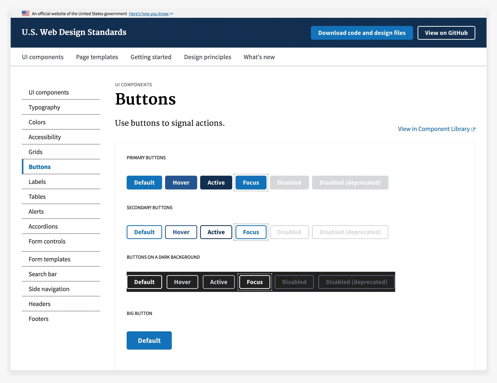
>US Government agency 18F 的设计模式库：U.S. Web 设计标准。

大部分设计系统文档会包含组件的名字、描述、示例、代码，有些还会展示一些元数据、版本历史等。不过，最好还是根据团队具体情况来，这份文档最重要的作用还是帮助团队成员更好地协作。

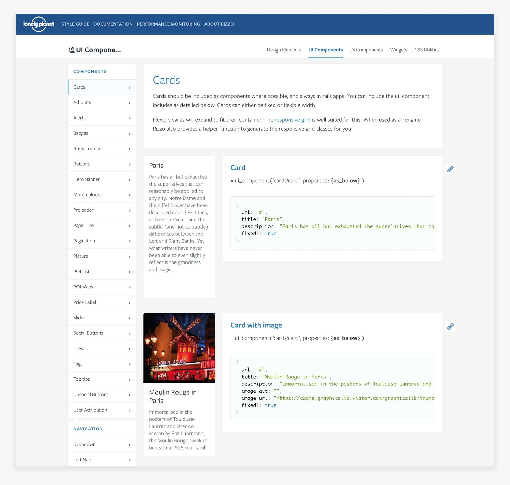
>Lonely Planet 的 Rizzo 组件文档。

## 最后
创建一个设计系统不仅仅可以帮助你的团队构建一致的用户体验，还可以搭建设计和开发之间的桥梁。设计师和工程师一起用设计 token 创建一个视觉语言，用组件构成一个组件库，共同维护，这将极大地提高两者之间的沟通效率。并且，这个设计系统会变得更加易于管理，更加可扩展，更加稳定。
