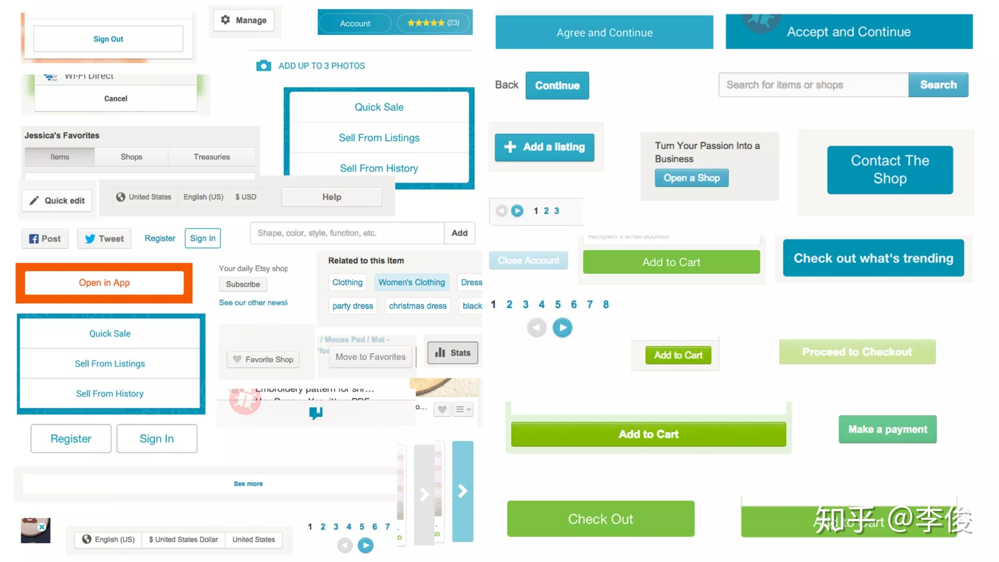

原文首发于公众号 Codesigner：https://mp.weixin.qq.com/s/AsDsCx_w1W6lLw77a4I35Q

>设计系统让团队理解并使用一种统一的设计语言。他可以减少你的设计负债，加速设计流程，连接产品设计和开发实现之间的鸿沟。学习如何构建设计系统可以帮助你提升产品体验，减少设计负债。这是来自于 InVision DesignBetter 站点的一系列设计系统相关的文章，我准备连载翻译，希望能帮助更多人理解并运用设计系统。

在 1960 年代，计算机技术的发展速度远远超过了软件研发的速度。电脑变得更快更便宜了，而软件研发却仍旧十分缓慢，且很难维护，漏洞百出。这种差距，以及该如何应对的窘境，被称为“[软件危机](https://en.wikipedia.org/wiki/Software_crisis)”。

在 1968 年，[NATO 软件工程会议](http://homepages.cs.ncl.ac.uk/brian.randell/NATO/nato1968.PDF)上，Douglas McIlroy 提出了组件式开发的解决思路。组件式开发通过代码重用来提高软件编程的潜能，使其更加高效并且易于扩展。这大大降低了软件研发的所需的人力，并且提高了研发速度，使得软件可以更充分地利用计算机的能力。

现在，50 年之后，我们正经历着一场相似的挑战，但这一次是在软件设计领域。现在的设计流程已经不能满足软件迭代的节奏，因为我们的设计方式仍然处于定制化地解决单个问题的处境中，不能很好地规模化。

你是否遇到过这种情况：当你评审以往的设计稿时，发现自己用了很多种相似的蓝色，或者是一组相近的按钮，它们散落在你产品的不同角落中。此时你开始意识到，你的设计竟然如此不统一，如此不完整，而且如此难以维护。

>一组杂乱无章的设计组件，以前越随意，你就要为此买单越多。

在这种状态下，想让设计的步伐跟上开发节奏，公司可能会做三件事：

* 招来更多人
* 加快设计速度
* 找到一个能一举多得的解决方案

即使招来了更多的熟练的设计师，这种定制化作坊式的设计模式也难以规模化。因为这种模式本身就很慢，难以统一，并且随着时间变化越来越难以维护。

设计系统通过“设计复用”让设计团队更好更快地设计产品，并使规模化成为可能。这就是设计系统的初始出发点：**通过一系列可以复用的设计组件，结合一定的标准规范来组装它们，快速构建不同的应用**。

过去 50 多年来，工程师通过这种方式成功运转工作流程。现在，设计师们也意识到了设计系统内在的潜力，加入这个行列。

## 用系统思维让设计规模化
最近这段时间你可能已经注意到“设计系统”在行业内被讨论得越来越热烈。设计正在规模化，很多公司开始往设计中投入越来越多，提供更好的用户体验来提升产品的竞争优势，以此吸引更多客户，同时减少无意义的支出。

这种公司内部一般有这么几种特征：

* 设计团队正在增长
* 每个团队都有设计的身影
* 从产品层到平台层，设计扮演的角色越来越重要

如果你是一个设计师，这种对设计方面的投入会让你很兴奋，但这也伴随着挑战。你如何保证这么多团队这么多产品保持设计上的统一？你如何保证这么多团队快速迭代？有一部分设计师不可避免地要设计一些定制化的东西，这一部分东西你将如何维护呢？

为了理解设计系统如何面对并解决这些挑战，我们有必要先理解设计系统是什么？设计系统其实是将两个概念的优势结合起来，形成一个更加强大的东西。

### 标准规范
>了解 Macintosh 用户界面的技术知识在产品设计中至关重要，但是理解用户界面背后的理论能够帮助你创造令人惊艳的产品。
**苹果人机交互指南**

理解一个系统的设计背后是什么，同时理解为什么，对于构建惊人的用户体验是极其重要的。定义和遵循标准规范是我们构建这种理解的方式，因为它会消除主观臆断和模糊不清的东西，让我们的团队协作阻力和困惑更小。

在设计和开发中都要遵循标准规范。当我们将一些东西，比如命名方式、可访问性要求、文件结构都标准化，那么团队合作就更加一致，并且能减少错误。

视觉语言是设计标准规范的核心部分。定义好颜色、形状、文字、图标、间距和动画的样式及目的，可以帮助你创造更加一致的品牌感和用户体验。再由这些元素组合成设计系统中的组件，它们会在传达品牌的个性时起到十分重要的作用。

没有标准规范，决策变得武断且难以评判。这样会导致设计没法规模化，也让用户体验变得支离破碎。

>**提示：跨平台特性**
你的设计语言应该是能够跨平台的，保持在 web、iOS、Android 和 email 上的表现一致性。在你的设计系统中显著的位置展示它们，并给出详细的文档，这可以帮助其他成员了解组件应该长什么样，具有什么样的行为。举个例子，谷歌的 Material Design 就深入介绍了他们[设计语言](https://material.io/guidelines/style/color.html)的方方面面。

### 组件
组件时设计系统中可复用的代码，也是组成用户界面的基本元素。组件的复杂度不尽相同。当一个组件功能最小化时，比如一个按钮组件或一个下拉菜单组件，可以让设计系统变得更加灵活，复用程度更高。而一些复杂的组件，比如说用于展示特定数据的表格，适用于一些特定场景，而这些场景是有限的。因此，组件可复用性越高，后期维护的工作量就越小，设计系统也就更易于规模化。

组件式开发通过代码复用来减少开销，而标准规范管理组件的目的、样式和用法。这样，你就可以用一个系统来辅助团队协作，并让所有成员更清晰地理解要做的是什么以及为什么要这么做。

## 设计系统的价值
让我们来详细地了解一下设计系统是如何从多方面解决日益增长的痛点的。

### 让设计规模化
随着团队增长，每个设计师都专注于自己的一亩三分地，比如我只负责搜索，你只负责发现页，他只负责账号管理，等等。这就会导致设计语言支离破碎，就像是一个设计的通天塔，每个设计师都讲着不同的语言——设计师各自解决各自的问题，没有系统性思考。

没有共同的设计语言来约束产品，设计流程和用户体验就变得不统一。当团队没有形成统一的设计惯例，设计评判也变得不够高效。想要在团队内形成统一的惯例，就必须要有一个共享的库，来存放公共的设计模式和样式。

一般来说这是一些静态文件，比如说一些示例元素，但是这种方式很容易过时。所以，很多团队会采用 [Shopify Polaris](https://polaris.shopify.com/) 这种方式，系统性地展示包含组件、设计规范和设计最佳实践，而且这个系统是动态的，随时更新的。

内部的设计系统站点可以保证团队所有人都拥有一份统一的设计数据源，并及时保持同步。

### 管理设计负债
随着团队和产品增长，会有很多负债。这里所说的负债，不是指金钱上的，而是指设计和技术上的负债。当我们为一些短期目的做设计时，就会出现设计负债。大量丰富的不可复用的和不统一的样式或模式，就形成了设计负债，并导致设计系统的维护变成不可能的任务。随着时间流逝，这种负债积累起来，让我们在前进的道路上的负担越来越重。

设计创造不会恒定产生负债，就像花钱不会恒定产生金融负债一样。但是设计系统可以让你的设计工作更加有计划性，不会产生太多设计或代码上的负债，同时也让你的设计模式持续增长，有效促进产品迭代。

### 保障设计统一性
一致可复用的标准化组件可以让产品设计变得更加统一，更容易理解，且更加可预测。同时，标准化组件也让设计师更多地专注于如何构建更好的用户体验，而不是样式来回调整。

### 快速构建原型
基于设计系统，可以快速地构建界面、交互和流程，就像搭乐高积木一样。这可以让你快速构建一些产品原型或实验性的功能，来进行测试以快速验证想法。

### 快速迭代
不管是样式迭代还是用户体验改进，使用设计系统都可以减轻工作量。以前可能要更改几百行代码，现在只需要改动几行就可以了，迭代更加快捷无痛，可以快速探索产品方向。

### 提高可用性
不够一致的界面会妨碍产品可用性。当无数各自独立的元素和交互形式组合在一起，页面越来越重，造成明显的加载延迟，这将会导致极其糟糕的用户体验。同时，这些代码会产生潜在的冲突，让你的产品变得脆弱。使用设计系统之后，我们可以使用统一的全局的组件库，而不再是独立分散的组件，来避免这种潜在冲突，保证产品质量。

### 提升无障碍可访问性
有了设计系统，我们可以在组件层面优化无障碍可访问性，来帮助残障人士或网络、设备不好的人获得更好的使用体验，这也是一种易用性的提升。在第三节《构建你的设计系统》中，Katie Sylor-Miller 将解释设计系统如何依照当地法律来提高无障碍可访问性。

## 设计系统迷思
尽管设计系统有这么多好处，在很多团队内引进设计系统也是一件极难推进的事情。设计师会感觉自己被束缚被限制，但通常这些容易被感知的缺点反而是设计系统最大的优势。

让我们来一一解开这些在推广设计系统时常常听到的迷思吧。

### 迷思 1：限制性太大
**迷思**：负责单一模块的设计师常常会认为这一模块的设计应该与其他模块不同。正因为此，一个通用的系统常常会被认为具有太多限制并且不能很好地满足一些特定模块的需求。

**现实**：设计师常常会为某一个特定模块想出一些独特的方案，长此以往就欠下很多设计负债。而有了设计系统，我们也可以创建一些新的设计模式来解决问题，这些设计模式同时反哺设计系统，让更多模块的体验同时得以提升。

### 迷思 2：让设计缺乏创造性
**迷思**：如果设计师被设计系统所束缚，就没有太多发挥的余地了。前端的积压任务中充满着设计样式更新的任务。设计样式迭代不算是小事情，而且有着很大的风险，很多新的特性代码会被不小心移除，也会对产品可用性产生负面影响。

**现实**：设计系统内的组件是相互依赖的，这意味着当你改动一个地方其它使用到这个组件的地方都会同步更新。这使得设计系统内的样式更新变得很容易做到，以前可能需要几星期做完的工作，现在只需要一个下午就搞定了。

### 迷思 3：设计系统是一次性的
**迷思**：设计系统一旦构建好，就算是完成了。

**现实**：设计系统是动态的、变化的，它需要跟随产品需求不断维护和进化。你的产品是构建于由可复用组件组成的设计系统之上的，因此设计系统的更新会自动同步于你的产品，这样就可以花费更少的时间来维护产品更新，而是转移到设计系统之上，也就更加容易规模化。

## 总结
设计系统并不是一时的风尚或者假说。当我们想要规模化设计流程来适应快速迭代的产品节奏时，就会发现这种基于组件的设计和开发模式是一种十分可靠的解决方案。

现在你应该理解了设计系统的价值所在，在后面的章节让我们深入探索基于设计系统的设计流程吧。

